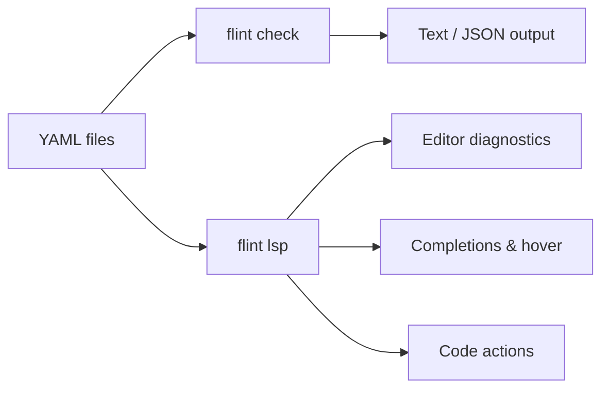

<p align="center">
  
</p>

# Flint

Fleet GitOps YAML linter and language server — catches configuration errors, typos, and misplaced keys *before* `fleetctl gitops` runs.


## What it does

- **Lint rules** — structural validation, semantic checks, security hygiene, deprecation warnings
- **LSP server** — real-time diagnostics, completions, hover docs, go-to-definition, code actions
- **Path tooling** — fix broken `path:` references after a reorg, and wire unwired profiles/scripts/software into fleets ([Commands](commands.md))
- **Generators** — turn a `.pkg`, `.mobileconfig`, or `.sql` into ready GitOps YAML; generate install policies and scripts
- **Migration reports** — JSON-based migration planning for Fleet version upgrades
- **Agent integration** — `help-ai` progressive discovery for AI-assisted workflows



## Quick start

**macOS** — download the signed & notarized PKG:

> [flint-0.2.0.pkg](https://github.com/headmin/fleet-editor-extensions/releases/latest/download/flint-0.2.0.pkg)

**Linux** — statically linked, runs on any distribution:

```bash
curl -fsSL https://raw.githubusercontent.com/headmin/fleet-editor-extensions/main/scripts/install.sh | sh
```

### The loop: check → dry-run → fix

**1. Look at your repo.** No configuration needed, nothing is written.

```bash
cd /path/to/your-gitops-repo
flint check .
```

**2. Ask the real question** — would `fleetctl gitops` accept this?

```bash
flint dry-run .
```

`PASS` means nothing flint knows about will fail the apply. Warnings are
advisory and do not block; add `--strict` to gate on them too. The exit code
is `0` for pass and `2` for blocked, so it drops straight into CI.

**3. Fix the easy things** — typo'd keys, deprecated renames, and `path:`
references that moved:

```bash
flint check . --fix
```

**4. Optional — narrow the scope**, if your repo holds directories flint
should leave alone. `flint init` walks them, asks in or out for each, shows
how many files each answer puts in scope, and writes `fleetlint.toml`.

```bash
flint init
```

**5. Put it in CI.** `--format github` emits annotations on the lines they
refer to in a pull request — no token and no `gh` required.

```yaml
- run: curl -fsSL https://raw.githubusercontent.com/headmin/fleet-editor-extensions/main/scripts/install.sh | sh
- run: flint check . --format github
```

Everything else — [`flint gen`](commands.md#generate-yaml-flint-gen) for YAML from real
artifacts, [`flint paths`](commands.md#path-references) for reference repair and
wiring, [`flint fleet`](commands.md#fleet-instance-views-flint-fleet) for
read-only instance views — is optional. `flint --help` lists it all.

## Editor support

| Editor | Install |
|--------|---------|
| **VS Code** | Download [flint-0.2.0.vsix](https://github.com/headmin/fleet-editor-extensions/releases/latest/download/flint-0.2.0.vsix) → `Extensions: Install from VSIX` |
| **Zed** | Download [flint-zed-0.2.0.zip](https://github.com/headmin/fleet-editor-extensions/releases/latest/download/flint-zed-0.2.0.zip) → install `flint` binary to PATH |
| **Sublime Text** | Install `flint` binary, add [LSP-flint](editors.md) config |
| **Neovim** | Install `flint` binary, configure as LSP with `cmd = {"flint", "lsp"}` |

## How it works

Flint validates Fleet GitOps YAML at two levels:

1. **Structural** — unknown keys, misplaced keys, typo suggestions (Levenshtein distance), missing required fields
2. **Semantic** — platform compatibility, label consistency, date formats, secret hygiene, path/glob validation

All validation runs offline with no Fleet server required. The schema is regularly cross-checked against Fleet's Go source for accuracy.
